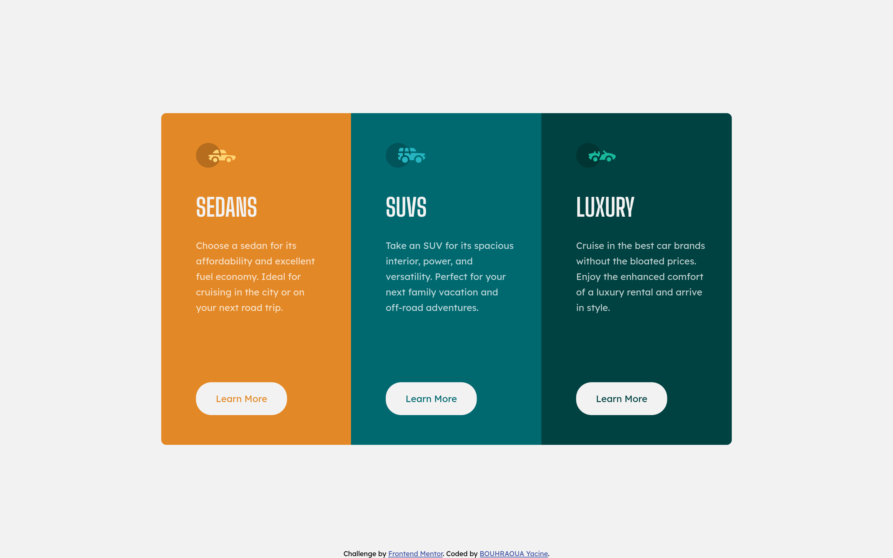

# Frontend Mentor - 3-column preview card component solution

This is a solution to the [3-column preview card component challenge on Frontend Mentor](https://www.frontendmentor.io/challenges/3column-preview-card-component-pH92eAR2-). Frontend Mentor challenges help you improve your coding skills by building realistic projects. 

## Table of contents

- [Frontend Mentor - 3-column preview card component solution](#Frontend-Mentor---3-column-preview-card-component-solution)
  - [Table of contents](#Table-of-contents)
  - [Overview](#Overview)
    - [The challenge](#The-challenge)
    - [Screenshots](#Screenshots)
    - [Links](#Links)
    - [Built with](#Built-with)
  - [Author](#Author)

## Overview

### The challenge

Users should be able to:

- View the optimal layout depending on their device's screen size
- See hover states for interactive elements

### Screenshots

### Links

- Solution URL: [Solution](https://www.frontendmentor.io/solutions/html-css-and-bem-hg21KYYYt)
- Live Site URL: [Github pages](https://bouhraoua-yacine.github.io/three-column-preview-card-component-main/)

### Built with

- Semantic HTML5 markup
- CSS custom properties
- Flexbox
- Mobile-first workflow
- [BEM](http://getbem.com/) methodology
- [FIGMA](https://www.figma.com/file/fP6FiaFM33O5A5XJvOq5MR/stats-preview-card-component-main?node-id=0%3A1) 

## Author

- Frontend Mentor - [@yorline](https://www.frontendmentor.io/profile/yourusername)
